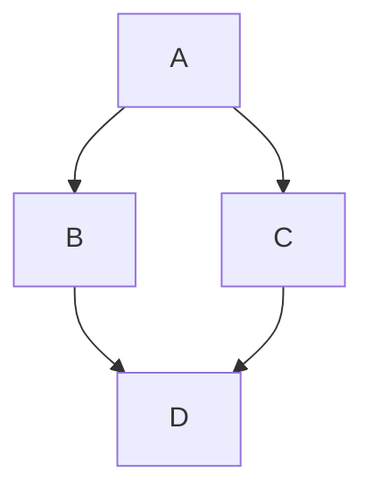

# Equitable-Polling-Locations-Refactor


## Installation

The code from this repository supports installation in a number of different ways to support different development approaches and systems. Chose the approach you feel most comfortable with. Once installed through any of these methods, you should have access to the command line interface.

### Pyenv/poetry (Best for Linux)

The recommeded approach is to use pyenv and poetry. Pyenv is used to install and manage a particular version of python while poetry handles creation of a virtual environment for the project and the dependency management. See the websites for pyenv and poetry for the respective installation approaches 


### Conda (Best for Windows)

This approach uses conda to create an environment in which poetry is installed. At that point, all dependency management is handed off to poetry to maintain consistency with other installation approaches. As such, conda is used to bootstrap the environment with a minimum number of dependencies for it to manage.

Note for Windows users: Because the lock file included here was generated on linux, there is a possibility poetry raises errors when installing on linux as it looks for specific components which don't work on Windows. In the event this happens, delete the `poetry.lock` from your machine and re-attempt to run `poetry install` as described below.

- Create a conda environment: `conda env create -f conda_environment_definition.yml`
- Activate the conda environment: `conda activate equitable_locations`
- Validate poetry is working with `poetry --version`
- Install local project and python dependencies: `poetry install`

### Docker (Advanced)

This assumes that the docker and docker compose CLIs have previously been installed on the system (see their documentation for installation instructions). The commands below assume running in a `bash` terminal, but should work on other systems with minimal changes, especially if not attempting to save the logs. By default, `bin/build_deploy.sh` is designed to build the container and deploy it locally in a way to expose an API interface on port 8000. It also mounts the `logs` and `untracked` folders from this repository as a means to exchange data with the host system. The commands below expand upon the commands given in that script.

- If you've deployed using `bin/build_deploy.sh`, use `docker compose down` to stop the running comtainer.
- To build and tag the resulting image based on the latest code in your local repository, run one of the following commands:
  - To run a simple build where the status prints to the console: `docker build -t equitable_locations .`
  - To run a build and instead save the build logs to a text file for debugging:`docker build -t equitable_locations  --progress=plain  . &> build.log`
- While not fully implemented yet, the default entrypoint for the container is a script to start up an api server. If your desired development workflow is to not have the API running, see the `docker run` command below.

#### Manual interaction with docker

To start up a new ephemeral container run the following. This will override the api entrypoint and give you a terminal in the container
```bash
export UID=$(id -u)
export GID=$(id -g)
docker run -ti --rm \
-v ./logs:/app/logs \
-v ./untracked:/app/untracked \
--user ${UID}:${GID} \
--entrypoint /bin/bash \
equitable_locations
```


## Operation

### CLI Operation

To run against a single config file, use the `run_file` command and specify a path to the yaml:
`equitable_locations run-file untracked/test_config/Gwinnett_config_no_bg_school_church.yaml`

### Example Config

Note that the file paths given in the config are relative to the config file's location. When running in a container, pay special attention that the files being used are in a volume accessible to the container and that the file permissions are compatible with the user in the container.

```yaml
# Constants for the optimization function
location: Gwinnett_GA
year:
  - "2020"
  - "2022"
bad_types:
  - "EV_2022_cease"
  - "Elec Day School - Potential"
  - "Elec Day Church - Potential"
  - "bg_centroid"
beta: -2
time_limit: 360000 #100 hours minutes
capacity: 5
relative_partner_data_file_path: Gwinnett_GA_locations_only.csv

####Optional#####
precincts_open: 12
max_min_mult: 5 #scalar >= 1
maxpctnew: 1 # in interval [0,1]
minpctold: .8 # in interval [0,1]

```


## Architecture

### Class interactions



## Contributing

### Formatting

The following should be run before pushing any code:

- `ruff check --fix`
- `ruff format`

## Future Work

This is a very rough list of things which would be good to address in this prototype. These are in no particular order.

- Ensure each origin has a sufficient number of measured distances to possible destinations in order to avoid overly constraining the solution space. Possible approaches are as follows:
  - Possible, make sure each location has a distance to N actual polling locations and N potential polling locations of the correct types.
  - Verify that the "radius" is roughly half of the long edge of a county in real space.
- Expand Click interface functionality
  - Run folder of configs
- Add testing and coverage reports
- Build API to accept a post of json specifying polling config parameters. The default directory (or database) output location should be specified by environment variable on API server startup
- Move model generation and optimization code into a class
  - Inputs:
    - Polling Model Config
    - Base output directory
  - Outputs:
    - 4 dataframes
- Compare performance between different solving capabilities:
  - Current status: Initial experimentation shows HiGHS standalone is much easier to install and only takes half the time to solve the same problem, and is therefor used in this prototype. `appsi_highs` is nearly a drop-in replacement for `scip` in pyomo. HiGHS is MIT licensed and therefore appears more permissive than scip which is currently used. For each attempt, we were unsuccessful in getting multiprocessing working properly, even after iterating on different approaches for compiling SCIP. The developers of SCIP have indicated multiprocessing is known to have a number of issues in their internal testing.
  - Options:
    - SCIP+SOPLEX (previously used in conda)
    - SCIP+HiGHS (needs to be compiled, currently there are bugs, see https://github.com/scipopt/scip/issues/102)
    - HiGHS Standalone (pip install)
  - Future work:
    - Revisit SCIP+HiGHS to evaluate performance
    - Compiling SCIP: Investigate metis install for mumps to see if this improves performance. Previous compiling efforts indicated issues with linking the libraries. This may need attention to `--with-metis-cflags` and `--with-metis-lflags`
    - Compiling SCIP: check IPOPT is using mumps (flags)
    - Compiling for extra performance: look at compile logs for blas/lapack to ensure multithreaded possible (check env variables?)

- Repository configuration: add pre-commit formatting and checks on PRs
- Integrate with existing analytics code to ensure shared dependencies and interfaces
- Expand litestar api to trigger same commands as click interface
- Establish better location to cache data (OSM, Census, Isochrones, Networks)
- Expand input/output validation (type, shape, etc)
  - PollingModelConfig: Apply input validation and ensure loading parses inputs in a way that and converts them to the correct types.
  - Partner data
  - origin dataframe (each row?)
  - destination dataframe (each row?)
  - 4x Results dataframes
- Isochrone visualization capabilities
  - Map Figures
    - Create base layer: County with blocks/block groups
    - Polling location layer
    - isochrone layer
- Figure out how to incorporate R into a shared environment
- Build Diagnostics
  - plot a union of all largest-size isochrones against the county to identify weakpoints (optional heatmap)
