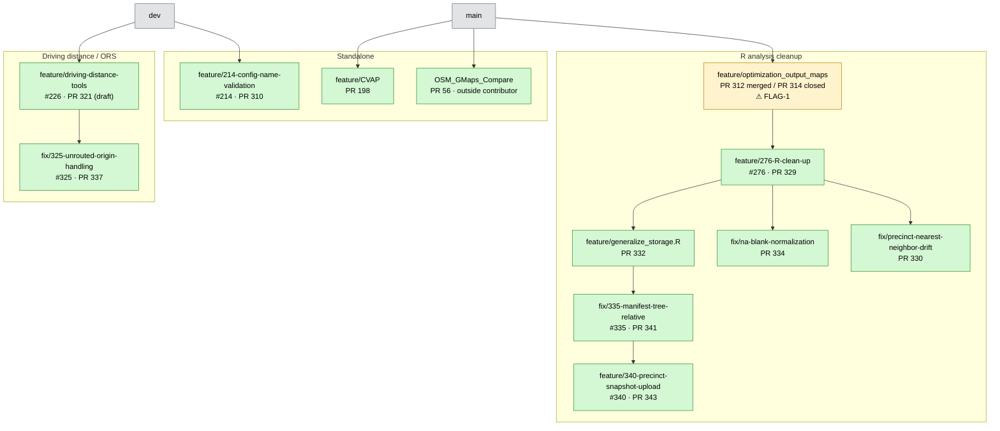

# Branch audit — September 2026

Working document. Reconstructs what is still outstanding across the repo's
unmerged branches, so stalled work can be found, finished, or retired.

**Not committed to `main` as guidance.** This is an in-progress audit, not a
decision record. Nothing here has been deleted or acted on.

## How we work on this

**`branch_audit.csv` is the single data file.** One file, 70 rows, four
columns: `Branch Name`, `Associated Milestone`, `Status`, `Final action`.
No sibling CSVs, no `_v2`, no seed/output pairs.

Turn-taking, because a spreadsheet lock and a script cannot both hold the file:

1. SA edits in LibreOffice, then **saves and closes**.
2. SA says go.
3. Claude reads it, modifies it, and writes back to **the same path** — never a
   new file.

Every change lands as a git diff, so it can be reviewed or reverted.

Rules learned the hard way:

- **Do not add columns.** If something needs explaining, it goes in this
  README, not a new column.
- **Do not guess into a cell.** Blank means unknown. A wrong value is worse
  than an empty one, because it looks like it was checked.
- Claude states the evidence for any value it fills, and the check that
  produced it, in this README.

`branch_audit.ods` is SA's; Claude does not write to it. It is stale relative
to the CSV.

- Snapshot taken: 2026-09-08, against `origin` after `git fetch --prune`.

## Scale

| | Count |
|---|---|
| Remote branches on `origin` | 67 |
| Not merged into `origin/dev` — **the scope of this audit** | 53 |
| Of those, with an open PR | 12 |
| Local-only branches on SA's machine, never pushed | 23 |

An earlier version of this table said 68 remote branches. That was wrong:
`git branch -r` emits a bare `origin` line for `origin/HEAD`, which is a pointer,
not a branch. The real count is 67, and that includes `origin/main` and
`origin/dev` themselves.

**The audit covers remote branches not merged into `dev`. It does not cover:**

- 14 remote branches already merged into `dev` (correctly excluded — they are done).
- **23 branches that exist only in SA's local clone.** Machine-specific — Chad's
  checkout will differ. These split into two very different groups, and the
  distinction is visible in `git for-each-ref`'s `%(upstream:track)`:

  - **20 with a `[gone]` upstream.** These *were* pushed, and the remote branch
    was later deleted — normal cleanup after a merge. The local copy is a stale
    leftover, not unbacked work. Includes `feature/246-rdh-demographics` and
    `feature/247-predicted-vap-validation-migration` (the RDH replacements from
    QUESTION-5) and `feature/auth-credentials`.
  - **3 with no upstream at all — genuinely never pushed:**
    `dev-cherry-pick-temp`, `devcontainer-r-extension-temp`, and
    `redo/tarrant-2026-for-review` (2026-08-29). The first two are named as
    throwaways; the third relates to the Tarrant delivery and is the only one
    that looks like it might matter.

  **A `[gone]` upstream is not evidence of lost work.** It usually means the
  opposite: the branch merged and was cleaned up correctly.

## Classification

Two independent facts, kept in two columns, because conflating them produced a
seven-value vocabulary nobody could hold in their head.

### `outcome` — what happened to the work

| Value | Count | Meaning |
|---|---|---|
| `LIVE` | 11 | Open PR right now. Real outstanding work. |
| `LANDED` | 14 | Its PR merged; the branch was just never deleted. Git still reports it unmerged because the merge was a squash. |
| `SUPERSEDED` | 2 | Its PR was closed, but the *work* was redone on another branch and merged. Branch discarded, work shipped. |
| `ABANDONED` | 2 | Confirmed dead by SA. |
| `UNKNOWN` | 24 | No PR, or a closed PR with no traceable outcome. Not determinable from git or GitHub. |

### Why `ABANDONED` requires a human

"PR closed without merging" is **not** sufficient evidence of abandonment — it
says the *branch* was discarded, not the *work*.

Both RDH-population branches were originally marked abandoned on that signal
and both were wrong. Review comments on PR #286 asked for process fixes (link
the ticket, describe the work); the work was redone on properly-ticketed
branches and merged as PR #290 and PR #291. The original PRs were then closed
on 2026-07-27 — **eleven days after their replacements had already merged.**
The work shipped. Only the branches were thrown away.

The check that catches this: when a PR is closed, look for a later merged PR
against the same base with a similar title, and compare dates. If the
replacement merged *before* the original closed, it was superseded.

`feature/save_regressions` (PR #165, closed 2026-08-29 against `main`, empty
body) has no replacement PR that I could find, so it is `UNKNOWN` rather than
abandoned. It needs a human.

### `evidence` — how we know

| Value | Count | Meaning |
|---|---|---|
| `github_pr` | 28 | PR state on GitHub. Hard evidence. |
| `user_confirmed` | 2 | SA said so in conversation. |
| `none` | 23 | No evidence either way. **These need a human.** |

`UNKNOWN` + `none` is exactly the set of 23 branches that cannot be resolved
without you or Chad.

### Epic branches are the unit that merges to `dev`

The repo's intended hierarchy is `main <- dev <- epic <- feature`. An epic
branch collects feature branches until the whole epic is ready, then goes to
`dev` as one piece. Epics usually correspond to a GitHub Milestone, which is
what the `Associated Milestone` column is really identifying.

Consequences, all of them normal rather than problems:

- **A feature branch stacked on an epic cannot merge to `dev` alone.** Its
  parent's fate decides it. `feature/279-distance-data-census-type` behind
  `feature/CVAP`, `feature/add_config` behind `feature/driving-time-metric`,
  and `feature/248`/`249` behind `feature/RDH-pop` are all this shape.
- **An epic with no PR of its own is not stalled by that fact.** It is
  accumulating features.
- **A feature merged into its epic and left undeleted is ordinary cleanup**,
  not stranded work.

The thing actually worth flagging is an epic that has stopped moving, or work
that landed on an epic *after* the epic merged onward — which is what happened
with `feature/optimization_output_maps` above.

### `is_base_for` / `child_prs` — does other work build on it?

A separate fact from status: whether any PR targets this branch as its base.
Ten branches do. This is what makes a branch an "epic" or integration branch,
and it is orthogonal to whether the branch's own work landed.

| Branch | outcome | Child PRs |
|---|---|---|
| `delivery/Monongalia_County` | UNKNOWN | 11 merged |
| `feature/RDH-pop` | UNKNOWN | 5 merged, 3 closed |
| `feature/driving-time-metric` | UNKNOWN | 4 merged |
| `feature/optimization_output_maps` | LANDED | 2 merged, 1 **open** (#329) |
| `feature/276-R-clean-up` | LIVE | 3 open |
| `fix/325-unrouted-origin-handling` | LIVE | 2 merged |
| `fix/335-manifest-tree-relative` | LIVE | 1 open |
| `feature/driving-distance-tools` | LIVE | 1 open |
| `feature/generalize_storage.R` | LIVE | 1 open |
| `fix/anomally_flagging` | LANDED | 1 merged |

The three `UNKNOWN` rows at the top are integration branches that absorbed 20
merged PRs between them and never had a PR of their own. They are not stale —
they are where the work went.

**And none of the three has reached `dev`.** Of the 14 `LANDED` branches, only
4 merged to `main` directly (`delivery/Bartow_County_GA`,
`feature/census_pull_standardization`, `feature/pretty_graphs`,
`testing/config_settings`). The other 10 merged into these integration
branches, which then stopped.

That does not affect deleting the 10 — their commits are preserved in the
branch that absorbed them, so they are safe to sweep either way. The
outstanding item is the integration branches themselves: three branches holding
20 PRs' worth of finished work that never got merged onward.

Counts verified against the CSV and against `git branch -r --no-merged origin/dev`:
53 rows, no duplicates, none missing, none extra.

## Why "unmerged" overcounts

The repo squash-merges. A squash-merged branch never becomes an ancestor of its
target, so `git branch --no-merged` reports it as outstanding forever. 14 of the
53 had a merged PR despite git calling them unmerged — 13 marked `DEAD_MERGED`,
plus `feature/optimization_output_maps` under `MIXED_SEE_NOTES`.

`testing/config_settings` was verified end to end as the worked example: squash
commit `ee4318de` is byte-identical to the branch tip across every file it
touched, PR #150 merged to `main` on 2025-09-22, and `main` has since evolved
past it. Dead.

The practical consequence: **git alone cannot tell you what is outstanding in
this repo.** GitHub PR history is the authoritative source. Diffing a branch
against current `main` is actively misleading for anything older than a few
months, because `main`'s own growth dominates the diff.

## Live work

Two stacks. These are confirmed from PR base refs, not inferred.

Epic branches with no PR of their own, but merges into them:

- `delivery/Monongalia_County` — cut from `dev`. 5 PRs merged in
  (#280, #284, #300, #301, #312).
- `feature/RDH-pop` — 2 merged (#322, #331), 2 closed (#286, #287).
- `feature/driving-time-metric` — 1 merged (#296).

## Milestones

GitHub Milestones are the authoritative definition of the project's epics.
All nine are currently open. The `milestone` column in the CSV maps branches to
them; `milestone_source` records how confidently.

| # | Milestone | Open | Closed | Branches |
|---|---|---|---|---|
| 3 | `epic-driving-distance-tools` | 10 | 0 | 3 |
| 4 | `epic-driving-time-metric` | 9 | 0 | 2 |
| 9 | Monongalia precinct extraction & distance flagging | 9 | 0 | 7 |
| 6 | RDH block-level population data | 8 | 0 | 5 |
| 7 | RDH block-level voter file data | 8 | 0 | **0** |
| 5 | R: Automated tests and lint | 8 | 0 | **0** |
| 8 | Architecture diagrams | 5 | 0 | **0** |
| 1 | `epic-e2e-followup` | 1 | 5 | 6 |
| 2 | `epic-auth-credentials` | 1 | 0 | 0 — work merged via PR #221, branch deleted |

`milestone_source` values: `github_ticket` (10 branches — ticket number in the
branch name maps to a milestoned issue), `inferred_from_pr_chain` (13 — no
ticket, but the PR it merged into makes the milestone unambiguous),
`needs_confirmation` (7 — the R-analysis storage stack, see QUESTION-3),
`no_ticket_or_milestone` (23).

### Work with no milestone at all

The inverse gap. Two real, ongoing categories of work have no GitHub milestone
tracking them:

- **Deliveries (4 branches)** — `delivery/Bartow_County_GA`,
  `chore/tarrant-distance-upload-script`, `scratch-Bartow-driving`,
  `feature/add_regression_Tarrant_County`. County deliveries are recurring
  work, and `delivery/*` branches are cut straight from `main` by design.
- **Infra / tooling (5 branches)** — `feature/214-config-name-validation`
  (open PR #310), `testing/config_settings`, `feature/contributing`,
  `feature/devcontainer`, `feature/docker-backup`.

Plus the R-analysis storage stack under QUESTION-3 — five open PRs, no
milestone. Together that is one open PR in infra and five in R storage that no
milestone is tracking.

### Milestones with no branch at all

Three milestones — **21 open issues between them** — have no branch started:
RDH voter file data (8), R automated tests and lint (8), Architecture diagrams
(5). This is outstanding work that a branch audit alone would never surface.

### `epic-auth-credentials` — resolved, not at risk

An earlier version of this document claimed `feature/auth-credentials` existed
only on SA's laptop, had never been pushed, and was unbacked. **All of that was
wrong.** PR #221 merged it into `dev` on 2026-06-18 and the remote branch was
deleted as normal cleanup; the local copy is a stale leftover.

The error came from treating "not on `origin`" as "never pushed". The
`%(upstream:track)` field distinguishes the two, and it reads `[gone]` here —
pushed, then deleted.

The milestone's one remaining open issue (#215, document the census API key
credentials model as an ADR) has no branch, which is expected for a docs task.

## Flags

### RESOLVED 2026-09-08 — delivered work was missing from the Monongalia delivery branch

`feature/optimization_output_maps` merged into `delivery/Monongalia_County` via
PR #312 on 2026-07-29 — a true merge commit, not a squash. Then PRs #323 and
#326 merged **into that feature branch** on 2026-08-02, four days later, and
were never carried forward.

#323's commit message reads "final changes requested by client". So the
delivery branch was missing work that had already been delivered: the
solver-assignment precinct outlines, polling-location dots, spreadsheet-safe
GEOID export, the regenerated heat maps and flagged-block CSVs, and the
long-drive-time route fetching.

**Fixed:** merged `feature/optimization_output_maps` into
`delivery/Monongalia_County` (merge commit `9242535f`, pushed 2026-09-08). It
merged clean and added exactly those 18 files, +11,838/−21. The feature
branch's tip is now an ancestor of the delivery branch.

`feature/276-R-clean-up` also carries this work, but under reorganized paths —
that branch is post-delivery tech-debt cleanup, so the delivered state belongs
in the delivery branch on its own timeline, not waiting on the reorg.

**How this was caught:** comparing each merged branch's current tip against the
head SHA GitHub recorded at merge time. Ancestry checks alone cannot see it —
a branch that is merged and then committed to looks identical to one that was
squash-merged. Worth re-running whenever branches are swept.

### FLAG-1 — the R stack roots on a branch that already landed

`feature/optimization_output_maps` was merged into `delivery/Monongalia_County`
via PR #312, and its own PR to `main` (#314) was closed unmerged. But it is
still the base of open PR #329, so the entire R-analysis stack — five open PRs —
is built on a branch whose work already went in by another route.

It also absorbed two merged PRs of its own (#323, #326), so it is simultaneously
an integration branch, a landed branch, and the base of live work.

This is likely a real problem in the stack rather than a bookkeeping artifact.
Needs a decision before any of #329/#330/#332/#334/#341/#343 can land cleanly.

## Open questions

### QUESTION-1 — the 208–213 test block — RESOLVED

`feature/208-cleanup-redundant-tests`, `209-driving-vs-haversine`,
`210-bad-types-absent`, `211-year-tests`, `213-fixed-capacity`. All by Chad,
all within 2026-05-17/18, none ever PR'd.

All five issues belong to milestone `epic-e2e-followup` and are **CLOSED as
COMPLETED**. They were closed manually in a bulk sweep — all five within the
same second on 2026-06-22, none closed by a PR. The subjects
(`fixed_capacity_site_number`, `bad_types`) are covered in `main`'s test suite
today, so the work landed by some other route.

**Verdict: the branches are stale leftovers.** Only #212 (discuss approach for
asserting county FIPS codes) remains open in that milestone, and it has no
branch.

Caveat: "the subject is covered in main's tests" is not the same as "the exact
tests these tickets specified exist." If that distinction matters, the tickets
are worth re-reading against the current suite.

### QUESTION-2 — the `log_*` trio

`feature/log_distances` (2024-12), `feature/log_comparison` (2025-01),
`feature/log_distance_access_regressions` (2025-03).

SA's recollection is that this work merged into `main` and the branches were
never deleted. **However: none of the three ever had a PR.** So the
squash-merge explanation that fits `testing/config_settings` cannot apply here.
If the work is in `main`, it got there by being rewritten by hand.

Unresolved. Cheapest way to settle it: name a function or behavior that work
introduced, and grep current `main` for it. Path comparison will not work — all
three predate the repo reorganization that moved `model_data.py` and friends
into `python/solver/`.

### QUESTION-3 — the R-analysis storage stack has no milestone

Superseded in part: the old `project_bucket` column was a guess invented from
branch names, and GitHub Milestones are the real answer.

The guess was wrong in one instructive way: `feature/276-R-clean-up` was
bucketed as "r_analysis", but issue #276 belongs to the **Monongalia precinct**
milestone. The R cleanup is part of the precinct work, not a separate track.
That column split Monongalia across three different invented buckets.

It is now `adhoc_group`, and is **blank wherever a real milestone exists** so
it cannot compete with the authoritative value. It survives only on the 30
branches with milestone `none` or `TBD`, where it is the only grouping
available — still a guess, and still worth correcting.

What remains open: seven branches in the R-analysis storage stack are marked
`needs_confirmation` because their tickets (#335, #340) carry no milestone and
their sibling branches carry no ticket at all —
`feature/optimization_output_maps`, `feature/276-R-clean-up`,
`feature/generalize_storage.R`, `fix/335-manifest-tree-relative`,
`feature/340-precinct-snapshot-upload`, `fix/na-blank-normalization`,
`fix/precinct-nearest-neighbor-drift`, `port-pr330-cleanup`.

Do these belong to the Monongalia milestone, or is the storage/manifest work a
separate initiative that needs a milestone of its own? Five open PRs are
sitting in here with no milestone tracking them.

### QUESTION-4 — the remaining no-PR branches

Not yet discussed: `feature/add_config`, `feature/docker-backup`,
`feature/penalty_test_fixes`, `feature/279-distance-data-census-type`,
`feature/OSM_GMaps_compare` (distinct from the 2024 `OSM_GMaps_Compare`),
`port-pr330-cleanup`, `scratch-Bartow-driving`, `scratch/fixed_capacity_tests`,
`feature/devcontainer`, `revert-197-feature/census_pull_standardization`.

`feature/devcontainer` is probably superseded — the devcontainer is in `main`
now — but that is an inference, not a confirmation.

## How to check a branch is safe to delete

Two tests. **Both are needed** — either one alone gives wrong answers, and this
cost several wrong conclusions during the audit.

1. **Ancestry against the actual merge target.** `git merge-base --is-ancestor
   <branch> <target>`. The target is often *not* `dev` or `main` — this repo
   merges into integration branches (`delivery/Monongalia_County`,
   `feature/RDH-pop`, `feature/driving-time-metric`), and testing only against
   trunks reports those as unmerged.
2. **Tip vs. the SHA GitHub merged.** Compare the branch's current tip to the
   PR's `headRefOid`. If they differ, commits were added *after* the merge.

Why each alone fails:

- **Ancestry alone** misses squash merges. A squash-merged branch is never an
  ancestor of its target, so it looks unmerged forever.
- **Head-SHA alone** misses the case where a *later* merge into the target
  swept the branch up. That is exactly what happened to
  `feature/optimization_output_maps` on 2026-09-08: it still fails the head-SHA
  test against PR #312, but its tip is now an ancestor of the delivery branch,
  so nothing is stranded.

A branch is safe to delete when **either** test passes. A branch that fails both
has commits that exist nowhere else — check them before deleting.

Confirming that a commit's *content* landed is a third, separate question, and
path comparison will not answer it across the R directory reorg or the
`python/solver/` restructure. Grep for a distinctive identifier from the diff
instead — that is how `SOLVER_PRECINCT_SHAPEFILE` was traced from `#323`
through `feature/276-R-clean-up`'s renamed files.

## Approach that does NOT work: inferring parents from merge-base

Attempted 2026-09-08 and rejected. For each branch, take every other branch as
a candidate parent and pick the one whose merge-base with it is most recent.

It fails, and it fails confidently:

- **Direction is invisible.** It reported `fix/325-unrouted-origin-handling` →
  `fix/make_325_branch_comments_readable` *and* the reverse. Same for the two
  RDH-population branches.
- **Branches cut from `main` become magnets.** `chore/tarrant-distance-upload-script`
  branches from `main`, so it shares a recent merge-base with everything on
  main's line. It was named parent of 14 unrelated branches, including
  `feature/contributing` from 2024 and `OSM_GMaps_Compare`.

Merge-base proximity measures shared history, not intent. The cases it got
right were all ones where the PR base ref already gave the answer.

**Use PR base refs where a PR exists; ask a human otherwise.** The `TBD` values
in `parent_branch` need human input — there is no git-side shortcut.

## Sources of truth

1. **[GitHub Milestones](https://github.com/Voting-Rights-Code/Equitable-Polling-Locations/milestones)**
   — the definition of an epic. Not branch names, not directory structure.
2. **GitHub PR history** (`gh pr list --state all --head <branch>`) — whether
   work shipped. Git ancestry cannot tell you this; see above.
3. **Git** — only for branch existence and dates.

## Confirmed by SA so far

- `delivery/Monongalia_County` branches from `dev`.
- `delivery/Bartow_County_GA`, `chore/tarrant-distance-upload-script`,
  `feature/add_regression_Tarrant_County` branch from `main`.
- `feature/contributing` — dead.
- `feature/modular-distance-calculations` (PR #54, Jason Krizan) — dead.
- `OSM_GMaps_Compare` (PR #56) — live.
- `testing/config_settings` — merged via PR #150, branch never deleted.
- In `model_run.py`, `{config.config_set}_results` is the correct form;
  the `{config.location}_results` variant on `testing/config_settings` was
  superseded.
